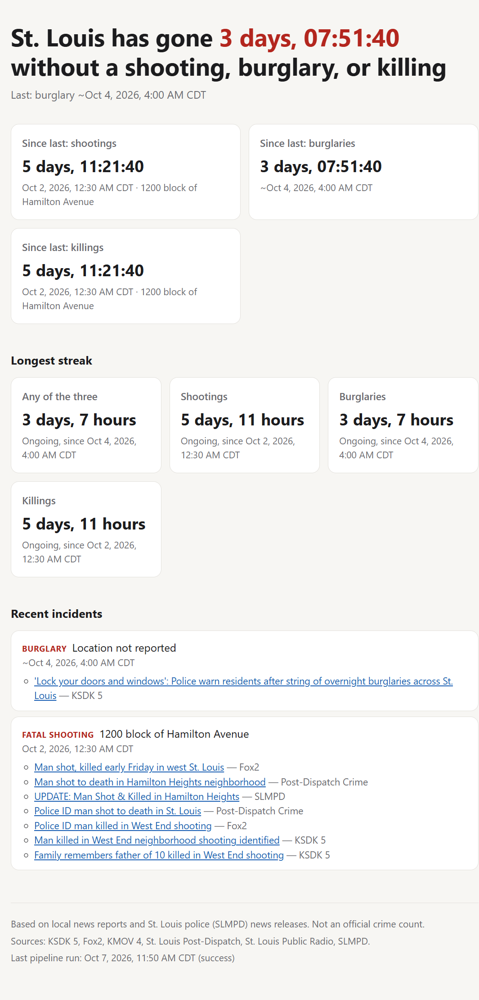

# STL Crime Timer

**How long can St. Louis go without a shooting, burglary, or killing?**

This project answers that question with a live timer. It reads local news and police reports every 10 minutes, uses AI to spot new crimes in St. Louis City, and resets the timer when one happens.

🔗 **Live site:** https://stlcrimetimer.com

 

---

## What you see on the website

- **The main timer:** time since the last shooting, burglary, or killing.
- **A timer for each crime type:** shootings, burglaries, and killings separately.
- **Longest streak:** the longest stretch with no reported crime.
- **Recent incidents:** each crime with its time, location, and links to the news stories about it.

---

## How it works (in plain words)

1. **Collect:** every 10 minutes, the system reads the latest stories from local news sites and the St. Louis police department.
2. **Filter:** stories without crime words (like "shot" or "burglary") are skipped right away.
3. **Understand:** an AI reads the remaining stories and answers: Is this a real, new crime? What type? Did it happen in St. Louis City? When and where?
4. **Combine:** if several outlets report the same crime, they are merged into one incident, so one crime only counts once.
5. **Show:** the website calculates the timers from the most recent confirmed crime.

```
News & police feeds → Keyword filter → AI classifier → Merge duplicates → Database → Live website
```

---

## Sources

| Source | Type |
|---|---|
| KSDK 5 | News |
| FOX 2 | News |
| KMOV 4 | News |
| St. Louis Post-Dispatch | News |
| St. Louis Public Radio | News |
| St. Louis Metropolitan Police Department (SLMPD) | Official police |

Facebook and social media are intentionally **not** used, because posts there are often unverified.

---

## What counts as a crime

**Counted:** shootings, burglaries, and killings that happened **inside St. Louis City** and were reported recently.

**Not counted:**
- Crimes in St. Louis County or nearby cities (Ferguson, Clayton, East St. Louis, etc.)
- Court news, sentencing, or trials
- Arrests for crimes that already happened
- Opinion pieces and crime statistics
- Car crashes and sports stories ("shot clock", "dead heat")

---

## Important limitations

- **Based on news reports, not official police data.** Many crimes are never reported in the news, so the real time between crimes is usually shorter than the timer shows.
- **Times can be estimates.** When a story only gives a day (not an exact time), the system marks the time as estimated.
- **AI can make mistakes.** Wrong incidents can be reviewed and removed by the admin, and the timer corrects itself instantly.

---

## Built with

| Part | Tool | What it does |
|---|---|---|
| Language | Python | Runs everything |
| AI | Groq (Qwen), Google Gemini as backup | Reads and classifies stories |
| Database | Supabase (PostgreSQL) | Stores stories and incidents |
| Scheduler | GitHub Actions + cron-job.org | Runs the pipeline every 10 minutes |
| Website & API | FastAPI on Render | Serves the timer page |
| Monitoring | UptimeRobot, Discord alerts | Warns if anything stops working |

Everything runs on free tiers.

---

## Project folders

| Folder | What's inside |
|---|---|
| `fetchers/` | Reads the news and police feeds |
| `classifier/` | Keyword filter and AI classification |
| `matcher/` | Merges reports of the same crime |
| `jobs/` | Runs all steps in order on a schedule |
| `api/` | Website and data endpoints |
| `alerts/` | Sends Discord alerts when something breaks |
| `alembic/` | Database structure changes |
| `tests/` | Automated tests |
| `docs/` | Design and deployment guides |

---

## Run it on your computer

Requires Python 3.11+.

```bash
# 1. Get the code
git clone https://github.com/<your-username>/stl-crime-timer.git
cd stl-crime-timer

# 2. Set up Python
python -m venv .venv
.venv\Scripts\activate          # Windows
# source .venv/bin/activate     # Mac/Linux
pip install -e ".[dev]"

# 3. Add your settings
copy .env.example .env          # then fill in your API keys

# 4. Create the database
alembic upgrade head

# 5. Run the pipeline once
python -m jobs once

# 6. Start the website, then open http://localhost:8000
uvicorn api.main:app --reload
```

**Other useful commands**

| Command | What it does |
|---|---|
| `pytest` | Runs all tests |
| `python -m classifier.eval` | Checks the AI's accuracy on sample headlines |
| `python -m jobs schedule` | Runs the pipeline every 10 minutes locally |
| `python -m alerts test` | Sends a test Discord alert |

For hosting it online, see [`docs/deploy.md`](docs/deploy.md).

---

## Reliability features

- If one news site is down, the others keep working.
- If the main AI is busy or out of free quota, a backup AI takes over.
- Duplicate stories are ignored, and the same crime reported by several outlets counts once.
- Follow-up stories (arrests, vigils, victim identified) never create new crimes.
- An outside monitor checks the site every 5 minutes and alerts if the pipeline stops.

---

## Author

**Mani Sharan**, Data Engineer
Built step by step with [Claude Code](https://claude.com/claude-code) as a hands-on data engineering project.

> *Not affiliated with any news outlet or the St. Louis Metropolitan Police Department.*